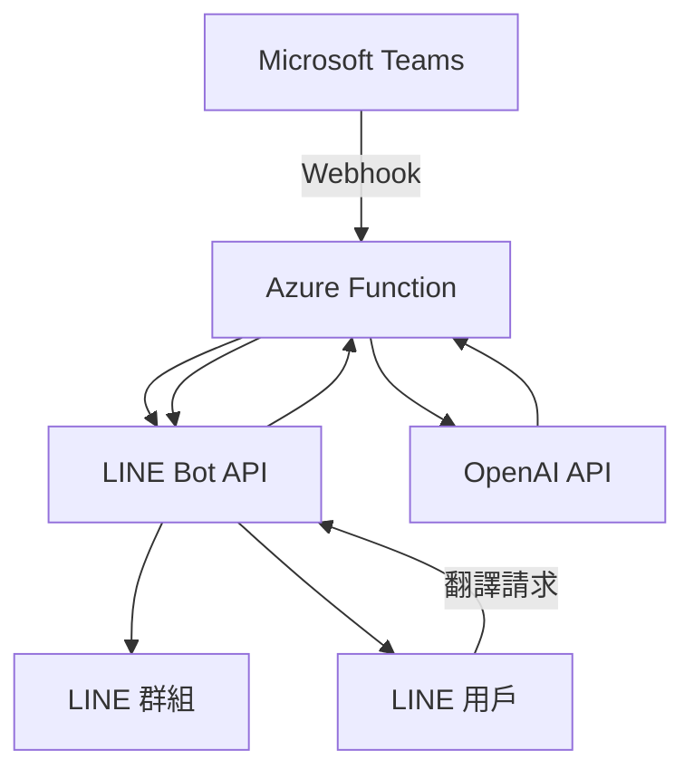

# Teams Meeting to LINE Group Bot

一個將 Microsoft Teams 會議通知自動轉發到 LINE 群組，並提供智能翻譯功能的 Azure Function 應用程式。

## 🌟 功能特色

### 📅 Teams 會議通知轉發
- 自動接收 Teams 會議邀請 Webhook
- 解析會議資訊（主題、時間、加入連結）
- 格式化為美觀的 LINE Flex Message
- 即時推送到指定 LINE 群組

### 🌐 智能翻譯機器人
- 使用 OpenAI GPT 模型進行智能翻譯
- 支援多語言互譯
- 自動偵測語言類型
- 保留原文格式和語境

### 🔒 安全性
- LINE Webhook 簽章驗證
- Teams Flow 驗證 Token
- 環境變數加密管理
- 錯誤處理與日誌記錄

## 🏗️ 架構設計



## 🚀 快速開始

### 前置需求

1. **Azure 帳號** - 用於部署 Function App
2. **LINE Developer 帳號** - 建立 LINE Bot
3. **OpenAI API 金鑰** - 翻譯功能
4. **Microsoft Teams** - Power Automate 設定

### 1. 環境設定

```bash
# 複製環境變數範例檔案
cp local.settings.json.example local.settings.json
```

編輯 `local.settings.json`：

```json
{
  "IsEncrypted": false,
  "Values": {
    "AzureWebJobsStorage": "",
    "FUNCTIONS_WORKER_RUNTIME": "python",
    "LINE_ACCESS_TOKEN": "你的LINE Bot存取權杖",
    "LINE_CHANNEL_SECRET": "你的LINE Bot頻道密鑰",
    "TARGET_ID": "LINE群組或用戶ID",
    "FLOW_VERIFY_TOKEN": "Teams Flow驗證權杖",
    "OPENAI_API_KEY": "你的OpenAI API金鑰",
    "OPENAI_MODEL": "gpt-4.1",
    "SKIP_SIGNATURE_VALIDATION": "false"
  }
}
```

### 2. 安裝相依套件

```bash
pip install -r requirements.txt
```

### 3. 本地測試

```bash
# 執行測試套件
python -m pytest test_function_app_unified.py -v

# 本地啟動 Function
func start
```

### 4. Azure 部署

```bash
# 建立 Function App
az functionapp create \
  --resource-group myResourceGroup \
  --consumption-plan-location eastus \
  --runtime python \
  --runtime-version 3.11 \
  --functions-version 4 \
  --name myTeamsLineBotApp \
  --storage-account mystorageaccount

# 部署程式碼
func azure functionapp publish myTeamsLineBotApp
```

## 📋 API 端點

### Teams Webhook 端點
```
POST /api/teams_webhook
Content-Type: application/json

{
  "attachments": [...],
  "body": {...}
}
```

### LINE Bot Webhook 端點
```
POST /api/line_webhook
Content-Type: application/json
X-Line-Signature: <簽章>

{
  "events": [...]
}
```

### 健康檢查端點
```
GET /api/health
```

## 🔧 設定指南

### LINE Bot 設定

1. 前往 [LINE Developers Console](https://developers.line.biz/)
2. 建立新的 Messaging API 頻道
3. 取得 Channel Access Token 和 Channel Secret
4. 設定 Webhook URL: `https://your-function-app.azurewebsites.net/api/line_webhook`

### Teams Power Automate 設定

1. 在 Teams 中建立 Power Automate Flow
2. 觸發條件：會議邀請建立
3. 動作：HTTP POST 到 `https://your-function-app.azurewebsites.net/api/teams_webhook`
4. 設定驗證 Token

### OpenAI API 設定

1. 前往 [OpenAI Platform](https://platform.openai.com/)
2. 建立 API 金鑰
3. 選擇適合的模型（建議 `gpt-4o`）

## 📖 使用說明

### Teams 會議通知

當 Teams 中建立新的會議邀請時，機器人會自動：

1. 解析會議資訊
2. 格式化為 Flex Message
3. 推送到指定 LINE 群組

### 翻譯功能

在 LINE 群組中：

1. 直接傳送要翻譯的文字
2. 機器人會自動偵測語言並翻譯
3. 支援中英日韓等多種語言

## 🧪 測試

```bash
# 執行所有測試
python -m pytest -v

# 測試特定功能
python test_azure_function.py
python test_webhook.py
```

## 📁 專案結構

```
├── function_app.py           # 主要應用程式邏輯
├── app_unified.py           # 統一應用程式（舊版相容）
├── reply_token_manager.py   # Reply Token 管理
├── webhook_logger.py        # Webhook 日誌記錄
├── requirements.txt         # Python 相依套件
├── host.json               # Azure Function 主機設定
├── local.settings.json.example  # 環境變數範例
├── tests/                  # 測試檔案
│   ├── test_function_app_unified.py
│   ├── test_webhook.py
│   └── ...
└── docs/                   # 文件
    ├── DEPLOYMENT_GUIDE.md
    ├── TESTING_GUIDE.md
    └── ...
```

## 🐛 疑難排解

### 常見問題

1. **LINE Webhook 簽章驗證失敗**
   - 檢查 `LINE_CHANNEL_SECRET` 設定
   - 確認 Webhook URL 正確

2. **Teams Webhook 無回應**
   - 檢查 `FLOW_VERIFY_TOKEN` 設定
   - 確認 Power Automate Flow 設定

3. **翻譯功能無作用**
   - 檢查 `OPENAI_API_KEY` 設定
   - 確認 API 額度充足

### 偵錯模式

```bash
# 啟用詳細日誌
export AZURE_FUNCTIONS_ENVIRONMENT=Development

# 跳過簽章驗證（僅測試用）
export SKIP_SIGNATURE_VALIDATION=true
```

## 🤝 貢獻

歡迎提交 Issue 和 Pull Request！

1. Fork 專案
2. 建立功能分支 (`git checkout -b feature/AmazingFeature`)
3. 提交變更 (`git commit -m 'Add some AmazingFeature'`)
4. 推送分支 (`git push origin feature/AmazingFeature`)
5. 建立 Pull Request

## 📄 授權

本專案採用 MIT 授權 - 詳見 [LICENSE](LICENSE) 檔案。

## 🙏 致謝

- [LINE Bot SDK](https://github.com/line/line-bot-sdk-python)
- [OpenAI API](https://openai.com/api/)
- [Azure Functions](https://azure.microsoft.com/services/functions/)

---

⭐ 如果這個專案對您有幫助，請給我們一個星星！
